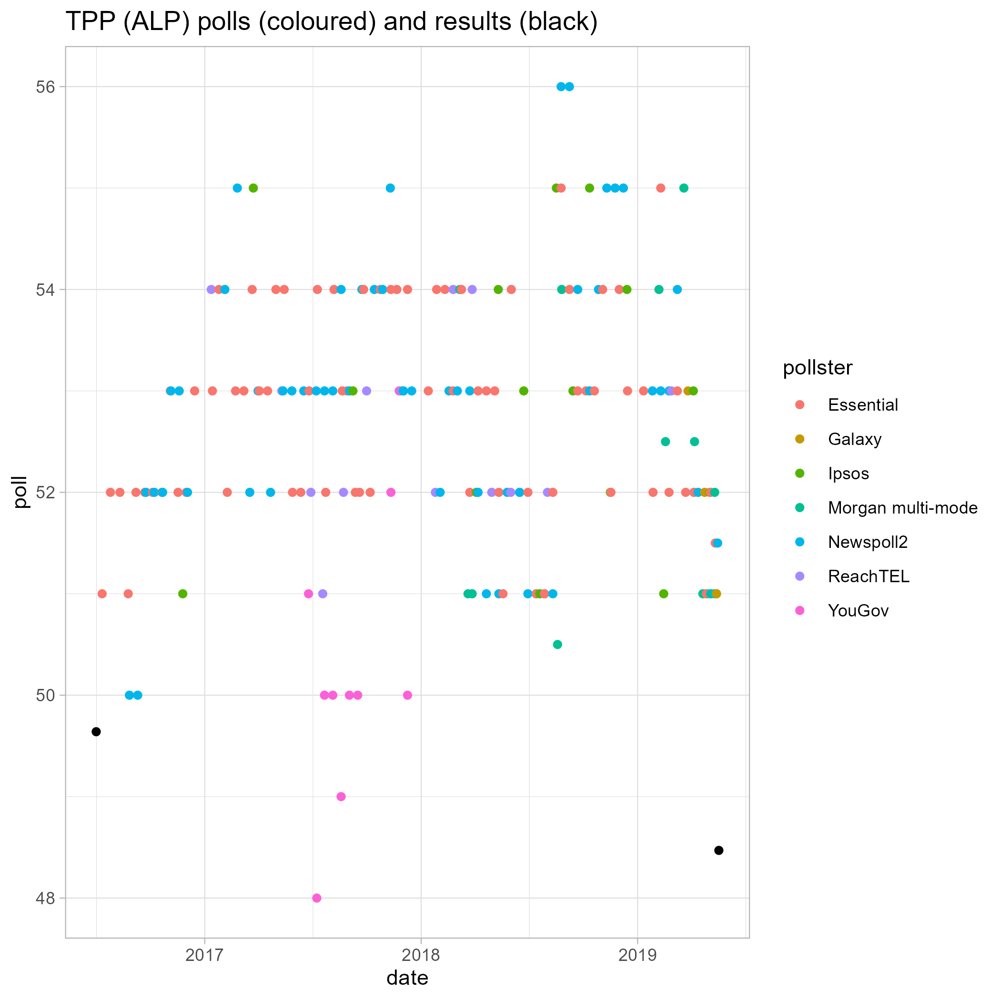
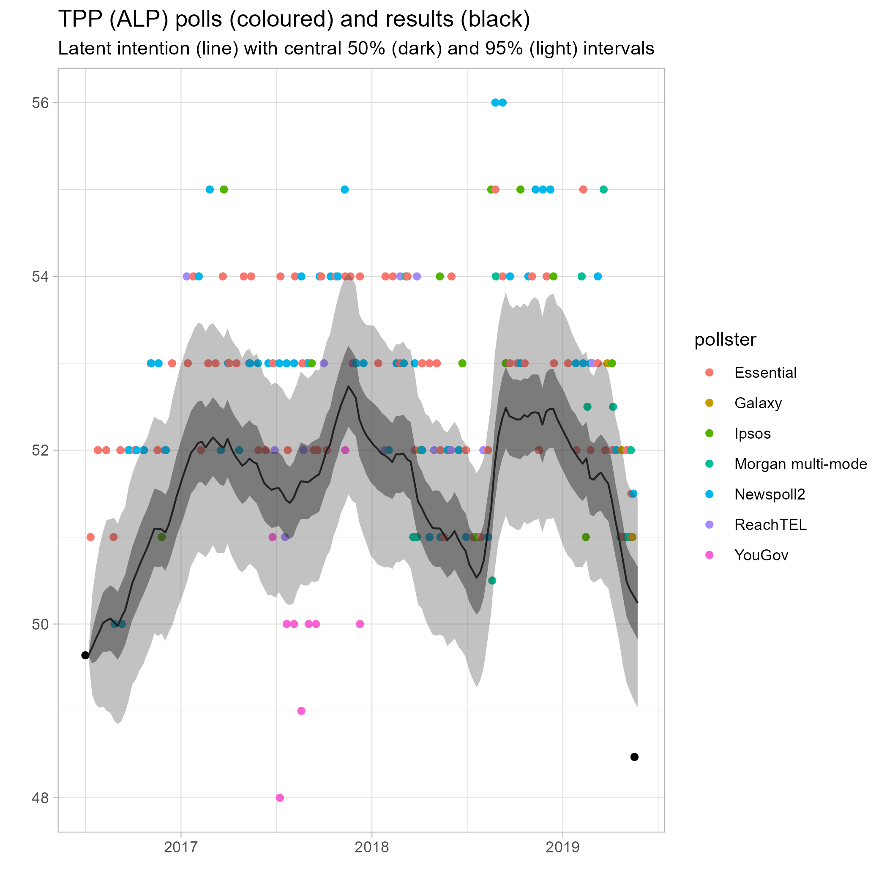
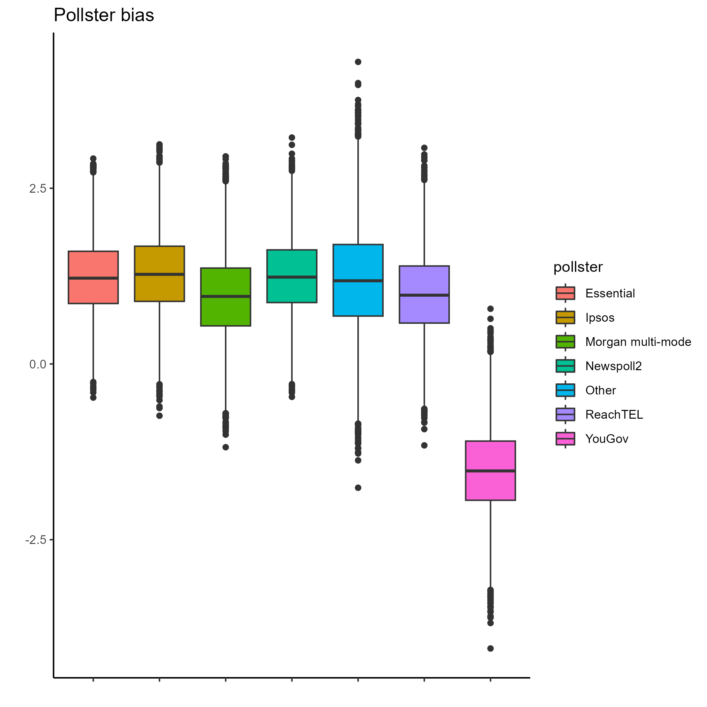
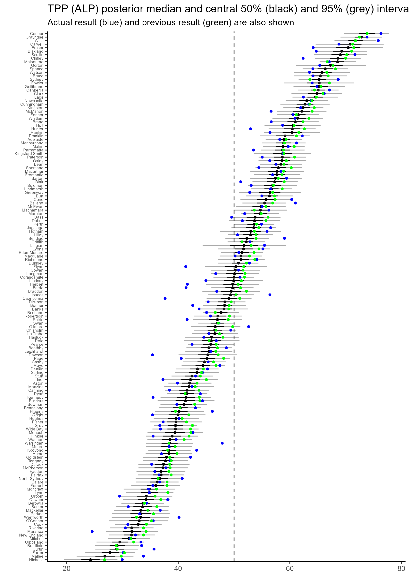
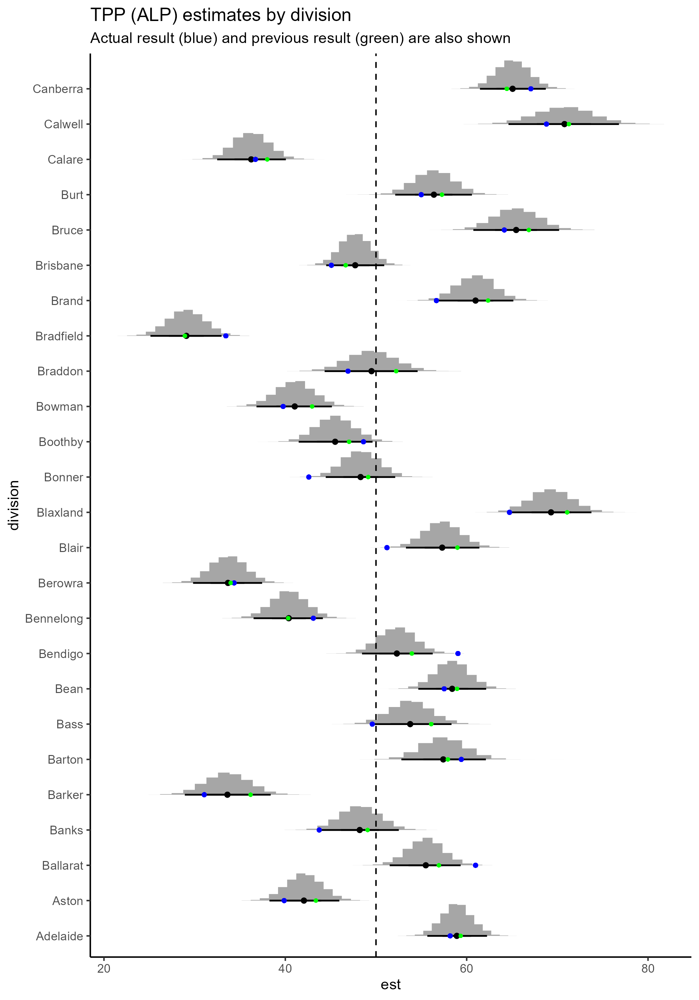
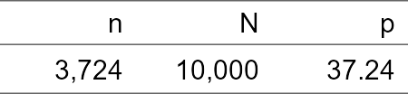

# README

# Introduction

This repository holds scripts for producing a prediction of the
two-party preferred (TPP) outcomes at the electoral division level. It
combines the poll-aggregation method similar to Jackman (2005) with
multilevel regression and post-stratification (MRP).

The basic idea behind the former is that there is a latent voting
intention, which evolves dynamically from week to week, that opinion
polls measure, subject to some systematic bias specific the polling
firm. Mathematically, we express this as

``` math
\begin{align*}
\text{poll}_i &\sim N(\pi_{t[i]} + b_{p[i]}, \sigma_{\text{poll}}^2) \\
\pi_t         &\sim N(\pi_{t-1}, \sigma_\pi^2) \\
b_p           &\sim N(0, \sigma_b^2)
\end{align*}
```

where $\pi_{t[i]}$ denotes the intention at the time corresponding to
poll $i$, and $b_{p[i]}$ the bias of the pollster corresponding to poll
$i$.

This method provides us with a way to estimate the national swing. We
simply project the voting intention forward to election day and then
take the difference between our estimate and the previous election
result. Thus, for instance, if the previous national TPP result was 49
and our projection is 51, the swing is 2.

We can then take this national swing and use it to produce a naive
estimate of the result for each electoral division: we take the previous
TPP result in that division and then add on the swing. Thus, if the
previous result in a given division is 45 and the swing is 2, our naive
estimate is 47.

We then pass this naive estimate through to a regression model, which we
train on record level TPP voting intention data. For simplicity we use a
linear probability model,

``` math
\begin{align*}
y_i     &\sim \text{Bernoulli}(\phi_i) \\
\phi_i  &\sim N(\eta_i, \sigma_p^2) \\
\eta_i  &=  \alpha_{\text{division}[i]} + 
  \beta_{\text{age group}[i]} + 
  \gamma_{\text{sex}[i]} + 
  \delta_{\text{education level}[i]}
\end{align*}
```

where $y_i$ is binary variable representing TPP support for the ALP,
$\alpha_{\text{division}[i]}$ represents our naive estimate for the
division corresponding to record $i$ and the other terms represent
secondary effects of demographic factors. For example,
$\beta_{\text{age group}[i]}$ represents the effect of the age group
corresponding to record $i$ on voting intention.

We use normal priors on each of the effect terms

``` math
\begin{align*}
\alpha_d &\sim N(\tilde \phi_d, 5) \\ 
\beta_a  &\sim N(0, 5) \\
\gamma_s &\sim N(0, 2) \\
\delta_e &\sim N(0, 5)
\end{align*}
```

where $\tilde \phi_d$ is the naive estimate for division $d$. The
information these priors encode is roughly that we aren’t very confident
in our naive division estimate, we think the effect of sex is relatively
small (a few points at most), but that the effect of age and education
is could be large. See Biddle and McAllister (2022) for some information
which vaguely justifies these choices.

We then use our trained model to estimate the probability of TPP support
for the ALP in each cell of a table defined by cross-classfying the
predictors (division, age group, sex, education level). Finally we can
estimate the overall TPP support for the ALP in a division by taking a
weighted mean across the cells of this table within each division. The
weights are defined by the cell sizes.

Thus, for example, a single cell in this table might be
`Adelaide-aged18to29-Female-bachelorDegree`. If there are 1200 people in
this cell, as determined by Census data, then the weight for this cell
is 1200. The effect of taking a weighted mean like this is that we
compensate for certain imbalances in the record-level voting intention
data. For example, we compensate for the fact that the sample includes
fewer males than females.

# Results

The raw national level polls look like



Adding our modeled latent intention over the top we get,



As an auxilliary result, we also obtained estimates of the bias of each
pollster



Our estimates for electoral division TPP support are,



Here is a closer look at the (alphabetically) first 25,



See `plots/estimates_page*.png` for similar plots of the other
electorates.

We can use the raw estimates shown above to frame more easily
comprehensible predictions to compare to the actual results. We use two
methods. The first classes seats into one of 7 categories using the
central estimate of TPP (ALP) support in each electorate,


The second uses the estimated probability that the TPP (ALP) support in
a given electorate is over 50%. It is also a little bit riskier insofar
as it is more willing to call seats one way or another than the first
approach,


For details, see the `predict.R` script.

As can be seen, both approaches yield similar results. The more
conservative approach only fails catastrophically by predicting a win
(loss) when in a seat that was lost (won) in two electorates. However it
refuses to return any prediction for 14 seats. The riskier approach, by
contrast, fails catastrophically in 3 electorates but only refuses to
return a prediction for 8 seats.

Finally we can obtain a prediction for which way the election as a whole
will fall by simulating the election many times over and counting the
proportion of times the ALP wins a majority. Doing this we get,



Thus we see that of our 10,000 simulations, the ALP manages to achieve a
majority (i.e. win \>75 seats) in under 40% of them. We would,
therefore, predict an ALP loss in 2019.

Given that this is exactly the opposite of what one might guess looking
at raw polls alone, and that 2019 was a notorious miss in terms of
election predictions, with many analysts predicting an ALP win, we can
feel very satisfied with this result.

# Diagnostics.

The regression component of the model fit fairly well, with the only
issue being a tiny number (29/10000) of divergences. Having reviewed the
pair plots and the trajectories that led to the divergences, I believe
these are ignorable. They are probably a result of using a linear
probability model, which, strictly speaking, is not correct. The dynamic
poll aggregation was somewhat less clean with a warning being raised
about low effective sample sizes. I’ve added an issue on the GitHub repo
about this and will return to it at some stage.

# Data

For the poll-of-polls step, our data is borrowed from the excellent
[Australian Electoral Forecasts
project](https://github.com/d-j-hirst/aus-polling-analyser).

For the MRP step, our poststratification table is derived from the ABS
Census and the polling data is taken from a Life in Australia (LinA)
panel conducted by the Social Research Centre. We take pre-processed
versions of each from [Alexander et
al.](https://github.com/RohanAlexander/ForecastingMultiDistrictElections).
We note that the LinA panel was conducted between 08/04/2019 and
26/04/2019. It is not included in the polling data that we used to
produce the poll-of-polls.
